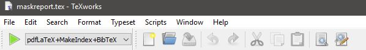

Heyho! Been a long time, eh? 24 days since my last post on how I could finally make a new post here. yeah, life been rough lately. But hey, self learning must keep on going, and keep on progressing yes?! (even it's veeeery slooow)

So now, I want to record my learning about on how things get so complicated when I want to make PDF as an output from Rmd file, in Windows. Yes, specific in Windows only. Because for my Mac, everything work without any hassle.

When you want to make a presentation or make a report by using R & RStudio, one of the option is export it to PDF. That means you will need to make a .Rmd file, then knit (export) it to PDF.

Googling around, I need package called `tinytext`. Long story short, I install the package, make the Rmd file. The last step will knit it to PDF presentation file (beamer). When I knit at my Mac, I just need to click the knit button, wait for a while, and that's all! A new PDF file will be created nicely.

But for Windows OS, it's not that easy! Beside you have to install `tinytext`, you also have to separately install MikTex separately, and it's 240.7 MB! Then, after you knit your document, for me, the R Markdown console showing a looooot of red text which means a looooot of errors...

But then, out of curiosity, I tried to see the working directory of my project. There, I saw a .tex file, which means, it's a half way to become a PDF file. So the sequence is .Rmd --\> .tex --\> .pdf.

I double click that file, and a new window pop up. It's a Texworks window. I'm guessing it's a part of the MikTex program that I previously installed, and it's like a GUI to process .tex document to become .pdf file.

After that new window pop up, I clicked that 'play' green button, let it run for a while, aaaand another new window pop up with newly generated pdf file like I wanted! Yeay!

But you know what? Even at the end I could generate the pdf file, the R Markdown console was still showing execution halted, or failed in generating the pdf file. Well, who cares? haha

One tip that I can share, you may need to reinstall tinytex by using `tinytex::reinstall_tinytex()` and/or `tinytex:::install_prebuilt()`, then clear knit cache from the knit button drop down menu.

I'm not sure which one that was made me finally able to generate the PDF file. I did all. Hahaha...

Well, that's all for this post! I hope it will be useful for someone, and at least it will be useful for me. hehe

see ya later!
